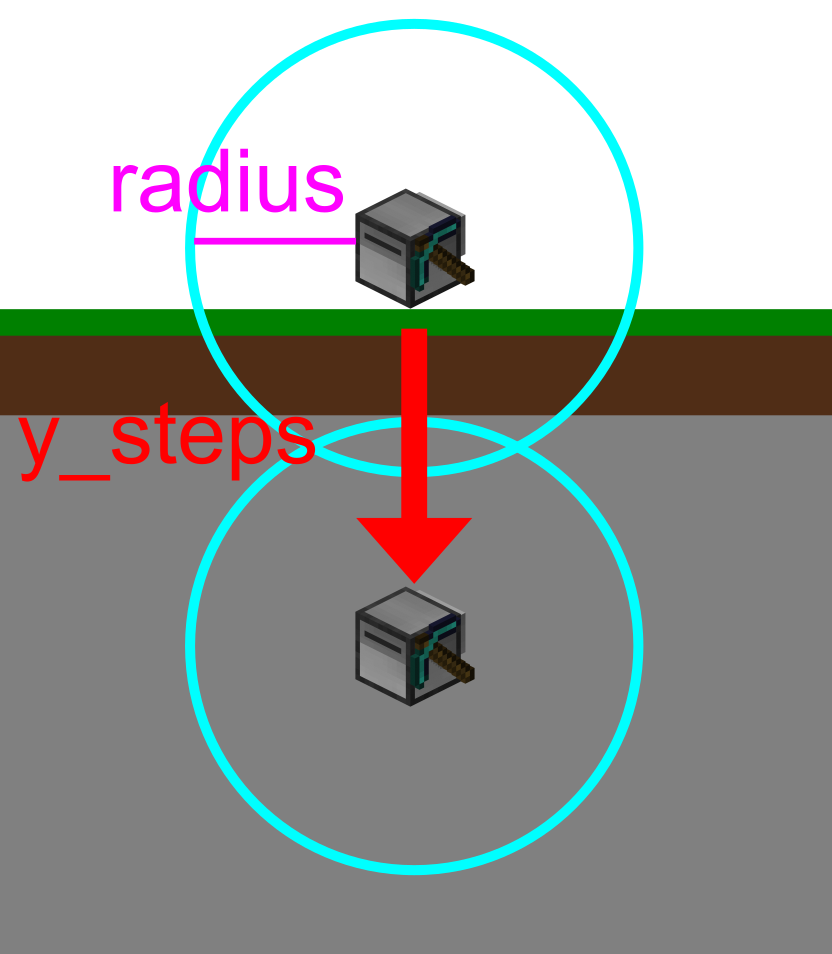

# ComputerCraft-GeoMiner
I wrote this program to fully utilize a ComputerCraft Mining Turtle equiped with an Advanced Peripherals Geo Scanner. 
## Requirements
To use this program you need to have Computercraft, Advanced Peripherals and Ender Storage installed.

You also need a Turtle equiped with a Pickaxe and an Advanced Peripherals Geo Scanner. The Turtle also need to have an Output Enderchest.

## Features

- Utilizes Geo Scanner to find Ores and mines them in *mostly* optimal path.
- Outputs into provided Enderchest
- Can be Fueled with an additional Fuel Enderchest
- Logs position and can resume its task after a server reboot, being unloaded, etc.
- Punches mobs standing in its way.
- Can search for specific blocks.

## Installation

Simply run these commands on your turtle.
```
pastebin get SAQa7UHv geomine.lua
```

```
pastebin get xynMWeLF startup.lua
```

## Usage
The input parameters represent the starting position of the turtle.
```
geomine <facing> <radius> <y> [search_ore]
facing:
n - North
e - East
s - South
w - West
radius - the radius the turtle will scan and mine
y - current y level
search_ore - i will try to only search for *search_ore*
```

For example, if the turtle's starting position is facing north and is at y-level 64 the command would look like this:
```
geomine n 8 64 _ore
```

Additionally, in this example the turtle would scan all blocks in an 8 block radius and mine blocks with "_ore" in their identifier name (eg. for iron_ore https://minecraft.fandom.com/wiki/Iron_Ore#Data_values).


## Config

At this time, every config option is located in the geomine.lua file itself. For the future that should be moved to its own file but i'm currently too lazy for that. ;)

Here are the current config options:
```
-- config
ENDERCHEST_SLOT = 16
BEDROCK_Y = -55
MAXERROR = 15
y_steps = 4
search_ore = "_ore"
fuel_enderchest = false
FUEL_ENDERCHEST_SLOT = 15
unmineable_ores = {"allthemodium_ore","allthemodium_slate_ore","unobtainium_ore","vibranium_ore"}
```

### ENDERCHEST_SLOT

When the Turtles inventory is full it tries to dump everything it has into its Enderchest. This entry defines the slot the enderchest is in.

### BEDROCK_Y

This is the Y level where the turtle can expect Bedrock to occur. Since it can't break bedrock it tries to avoid this layer.

This can also be seen as the maximum depth the turtle will mine to.

### MAXERROR
The Turtle expects that it can move through a block it just mined, sometimes gravel or something else can get in the way and this is the amount of times the turtle retries actions before giving up. This is to avoid using Server Ressources unnecessarily.

### y_steps

After mining every targeted block in a scan the turtle travels y_steps down before issuing a new scan.




### search_ore

By default the turtle tries to mine anything with "_ore" in its name, this default behavior can be changed here or specified with the "search_ore" parameter.

### fuel_enderchest

Disabled by default, set to "true" to enable. Since the Geo Scanner requires a lot of fuel it is recommended to provide the turtle with an 
enderchest where it can pull its fuel from when it runs out.

### FUEL_ENDERCHEST_SLOT

Specifies the slot for the fuel enderchest if it is enabled.
### unmineable_ores
I was playing the All the Mods Modpack, so there are static references to some Modpack specific ores which the turtle can't mine. the turtle won't try to mine these but will log them in "unmineable.data" since they are very rare and valuable.


## Known Issues
These Issues are known but i did not fix them yet. You may make pull requests ;)

- When encountering too many errors the turtle just crashes, perferably it would return home.
- The turtle does not take into account the amount of fuel a scan takes when calculating the required fuel to return home resulting in it not quite making it home.
